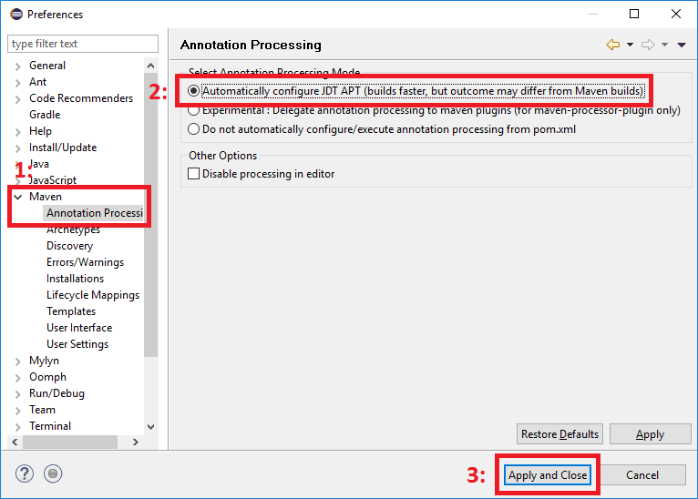

# Alexandria

A standard library of commonly used Java code.

The alexandria project is designed to provide a general-purpose library of Java code for a wide range of applications.
Things specific to Java but which should be shared widely among projects belong in this library.

# Developers

## Eclipse & APT

M2E allows Eclipse to read Maven pom files and automatically build Java projects very easily, however by default it does not (yet) support annotation processing.
To be specific, both Maven and Eclipse support annotation processing (apt), but M2E does not requires an additional maven plugin to provide full integration of the two.

To develop Alexandria or other projects which use `ax-annotations`, you you will need to install [`m2e-apt`](https://marketplace.eclipse.org/content/m2e-apt).
Simply drag the "Install" button from your browser to your Eclipse window, and follow the directions from Eclipse.

Once you have restarted Eclipse you will need to configure `m2e-apt`:

## Building Annotations

The [`ax-annotations`](ax-annotations) project provides some general purpose annotations for code documentation, along with an annotation process for reporting one them in compiler logs.
Because of the complex dependencies inherent in build annotation processors `ax-annotations` requires some care in building if you're a developer.
Below are the endorsed, though certainly not the only, steps to build alexandria for development.

1. Obtain the source code either by download or `git clone`.
2. `cd alexandria`
3. `mvn install -pl ax-annotations -am -Prelease`
4. Import [`alexandria/pom.xml`](pom.xml) into Eclipse, which should bring in all other sub-projects except `ax-annotations`.

## Release

1. Use maven to release the project and update versions
	1. `mvn release:prepare -Prelease`
	2. `mvn release:perform -Prelease`
	3. Release or drop [the staging repository](https://oss.sonatype.org/#stagingRepositories)
2. Publish changes to GitHub
	1. Open a [pull request](https://github.com/g2forge/alexandria/pulls) with the results of step #1.2, marking it with the milestone you've just released.
	2. Push the tag generated by step #1.2 to github
	3. Create the new [github milestone](https://github.com/g2forge/alexandria/milestones) and close the prior one
4. Local & downstream updates
	1. [Install the new SNAPSHOT version of annotations](#building-annotations) `cd .../ax-root && mvn install` then `cd .../ax-annotations && mvn install` 
	2. Update downstream projects (`<alexandria.version>XXX</alexandria.version>`, parent POM versions, etc)
	3. Update issue tracking. For Jira note that you will want to bulk-add the new fix version, and then bulk-remove the old version rather than replace since other versions may be involved.

# Modules

Below are notes and descriptions for a subset of the modules in this library:

* [FileSystem](./ax-filesystem) is a library which will aid you in writing your own Java NIO compatible file system provider.
	* [Memory FileSystem](./ax-filesystem-memory) is an in-memory file system which we have released both as a usable library and an example you may copy (this one module is [unlicense](./ax-filesystem-memory/LICENSE) unlike the rest of alexandria)
	* [FileSystem Test](./ax-filesystem-test) which is a small library you can use to build unit tests for your file system provider.
